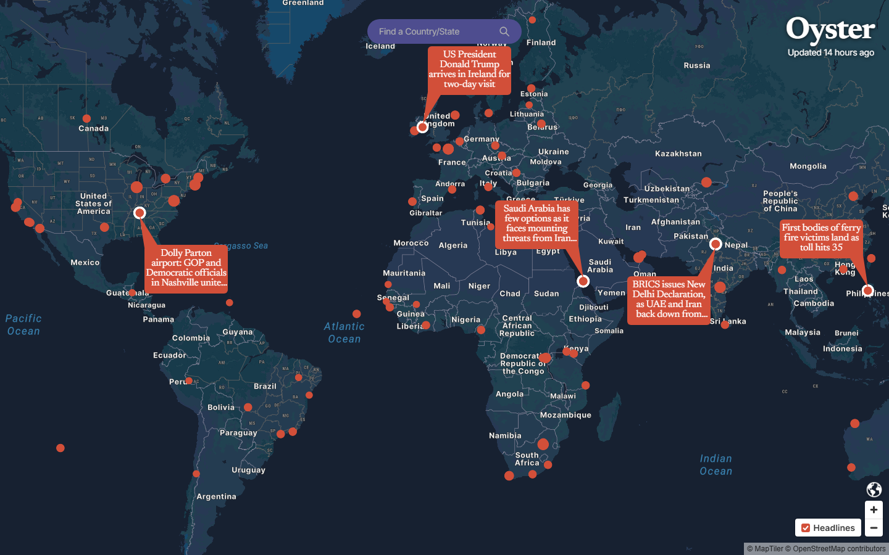
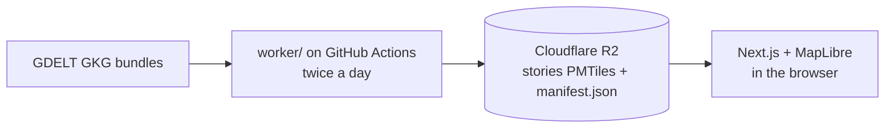

# Oyster

A 2D web map of current world news. Stories are plotted where they happen and
ranked by how many independent news organizations covered them, with wire
services and papers of record given precedence. More stories appear as you zoom
in.

**[Live here](https://sonder-drab-eta.vercel.app/)**



## How it works



A GitHub Action runs the ingestion pipeline twice a day over a rolling 24-hour
window. It fetches, parses, filters, places, groups, ranks and budgets stories,
tiles them with tippecanoe, and publishes a content-hashed archive to R2. The
browser reads `manifest.json` to find the current archive, so a normal publish
cycle needs no deploy.

## Stack

| Layer | Choice |
|---|---|
| Frontend | Next.js + React, MapLibre GL JS (2D) |
| Basemap | MapTiler, with an OpenFreeMap keyless fallback |
| Story data | PMTiles vector tiles on Cloudflare R2 |
| Boundaries | Natural Earth, built once into `public/boundaries.pmtiles` |
| Ingestion | GitHub Actions, TypeScript on plain Node |
| Database | None, on purpose (see [`docs/DESIGN.md#operations`](docs/DESIGN.md#operations)) |
| Tooling | Biome (lint and format), Vitest, `tsc` |

## Structure

```
src/
  app/          Next.js routes and global CSS
  components/   Map, panels, search, bubbles
  lib/          Browser-side logic shared with the worker (types, layers, labels)
worker/         The ingestion pipeline (run.ts is the entry point)
scripts/        Boundary and crosswalk builds, tippecanoe wrapper
  audit/        Placement accuracy audit: draw, place, score
data/           Reference lists: tier-1 domains, demonyms, blocklist, crosswalk
public/         Boundaries archive, place index, region bboxes
docs/
  DESIGN.md     The design document
  research/     Measurement logs and placement audit data
```

## Local development

```bash
npm install
npm run dev
```

The map reads published data straight from R2, so a fresh clone works with no
build step. Without `NEXT_PUBLIC_MAPTILER_KEY` the app uses the keyless
OpenFreeMap basemap and says so on screen.

`predev` and `prebuild` copy MapLibre's worker into `public/`. Keep that step:
MapLibre 6 builds its worker from a URL computed at runtime, which bundlers
cannot resolve, and without a real worker file the map never loads a tile.

## Scripts

| Script | What it does |
|---|---|
| `npm run dev` | Start the Next.js dev server |
| `npm run build` | Production build |
| `npm run check` | `typecheck`, `lint` and `test` in sequence |
| `npm run typecheck` | `tsc --noEmit` |
| `npm run lint` | `biome check .` (`lint:fix` applies safe fixes, `format` formats) |
| `npm test` | `vitest run` |
| `npm run worker` | Run the full pipeline once. **Publishes to production.** |
| `npm run data:boundaries` | Rebuild `public/boundaries.pmtiles` from Natural Earth |
| `npm run data:crosswalk` | Rebuild `data/crosswalk.json` |
| `npm run audit:draw` | Draw a blind judging sample, disjoint from earlier draws (fetches live GDELT) |
| `npm run audit:place` | Report which placement branches fire on live GDELT bundles, and suspicious shapes |
| `npm run audit:score` | Score a judged sample with Wilson intervals |

> **`npm run worker` is not a dry run.** It writes state shards, flips the live
> manifest, and moves the deployed map to the archive it just built.
> `BUNDLE_CAP=1` limits the *fetch*, not the *publish*: the pool is a rolling
> 24-hour window, so a one-bundle run still publishes the whole window.

Tiling needs tippecanoe 2.52.0 or newer. On Windows that means WSL:
`wsl -d Ubuntu -- sudo apt-get install -y tippecanoe`.

## Testing and CI

`.github/workflows/ci.yml` runs typecheck, lint, test and build on every push to
`main` and on every pull request. Tests cover `src/`, `worker/` and `scripts/`.
Components are verified in the browser, not by the test suite.
`.github/workflows/worker.yml` is the scheduled publish run.

## Further reading

- [`docs/DESIGN.md`](docs/DESIGN.md) is the authoritative design document:
  product framing, data reality, placement and ranking rules, the tile budget,
  panels, basemap and operations tradeoffs. Every chapter ends with the rejected
  alternatives.
- [`docs/research/gdelt-findings.md`](docs/research/gdelt-findings.md) and
  [`docs/research/basemap-case-study.md`](docs/research/basemap-case-study.md)
  are the measurement logs DESIGN.md cites.
- [`docs/research/placement-audit/`](docs/research/placement-audit/) holds the
  judged audit samples.

## Data

News metadata from [GDELT](https://www.gdeltproject.org/). Boundaries from
[Natural Earth](https://www.naturalearthdata.com/) (public domain). Basemap from
[MapTiler](https://www.maptiler.com/) / OpenStreetMap.

English-language sources only. Oyster links out to articles and never reproduces
article text.
